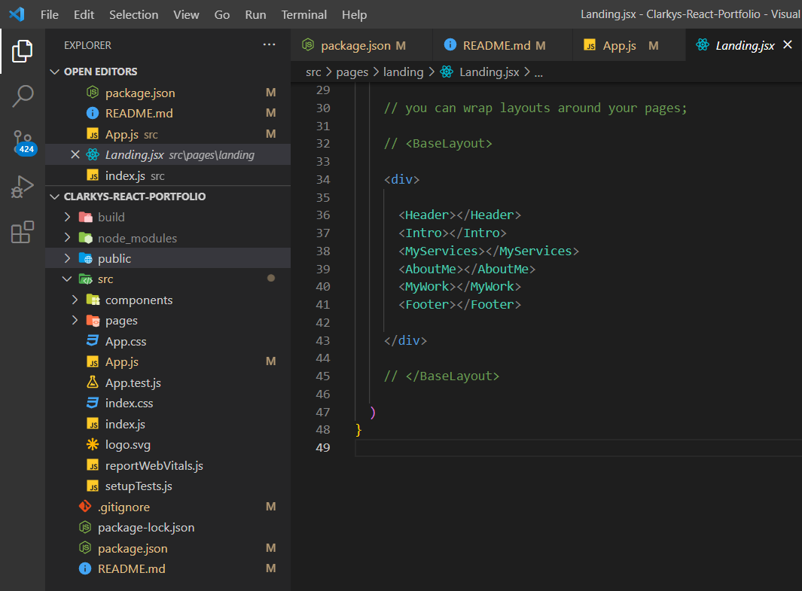
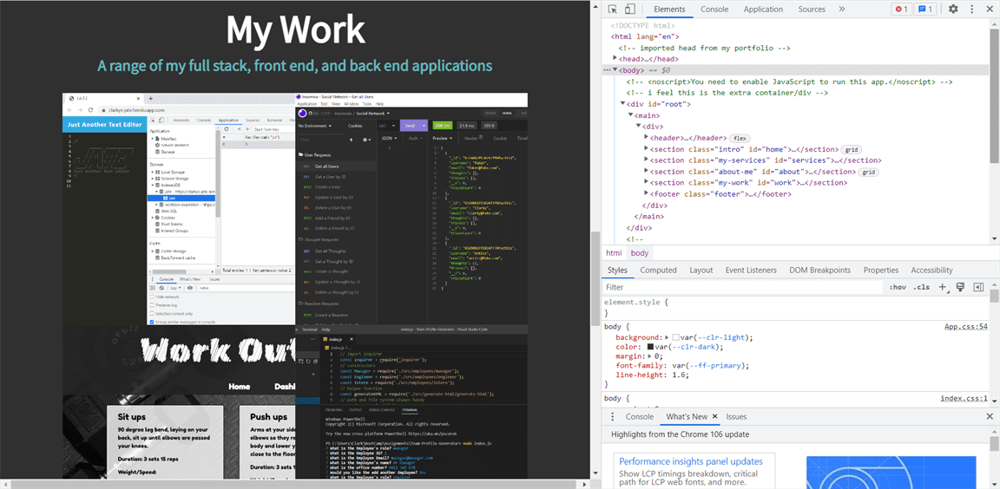
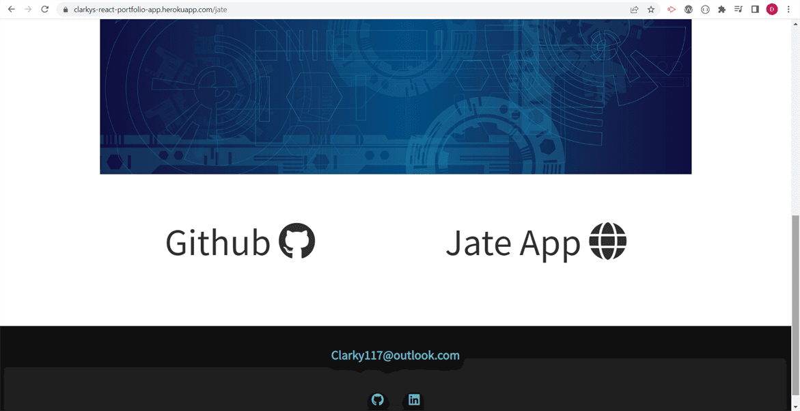

# React Portfolio

  
## Table of Contents
1. [Description](#description)
2. [Skills Used](#skills-used)
3. [Installation](#installation)
4. [Readme Visual](#visuals)
5. [Repository and Deployed Application](#links-to-repository-and-deployed-application)
  
## Description

This is my updated portfolio built using React.

## Skills Used

Firstly in a new folder I have created a new React app by running create-react-app followed by the title of my application, in this case, clarkys-react-portfolio. I have then initialised it as a repository and pushed to github to then begin my work.

I already had a portfolio site created so now it was just a matter of refactoring what I already had into components. I identified that i wanted a components folder, and a pages folders, and imported react-router to navigate around the site.

I started with the landing page, creating the Header/Nav, Intro, My Services, About Me, My Work, and Footer. Clicking on the menu icon will smoothly scroll out from the right a navigation menu presenting you with 1 of 5 options to move around the site.

Expanding on that, previously it was set up that if you clicked on an item from My Work, it would take you straight to the application or youtube video. However now there is a second page you will be taken to giving a brief description of the app, and presented with a link to the Github Repository and the deployed application/youtube video.

After that I have created a quick little contact page, which if the user tried to send blank they will find that each field is required, and validation is run on to make sure a valid email address is entered. Once the user clicks submit, and they confirm they are not a robot, i'll happily find the input in my inbox.

After you click on my Resume button, you will find that my my Resume is indeed downloaded to your local machine, this is done using an anchor tag in the html file with the attribute download.

You will find in the Footer my email address as well as links to my Github homepage and Linked In profile.

## Installation

No installation required.

## Visuals

Folder Structure

My Work Section

Portfolio Item Links

## Links to Repository and Deployed Application

- Repository - [Clarky's Repo](https://github.com/Clarky117/Clarkys-React-Portfolio)
- Live App - [React Portfolio](https://clarkys-react-portfolio-app.herokuapp.com/)